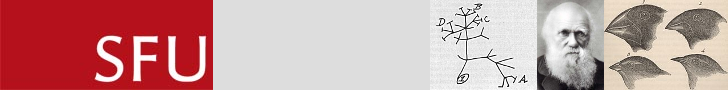

# BISC 300 Evolution (Fall 2013)

## Population genetics models

Use the apps linked below to explore the effects of evolutionary forces on population allele and genotype frequencies.

### Drift

- [drift](./drift/)

### Mutation

- [mutation](./mutation/)

### Migration

- [migration](./migration/)

### Selection

- [selection](./selection/)

### Combining Mutation, Migration, and Selection

- [mutation, migration, selection](./combo/)

